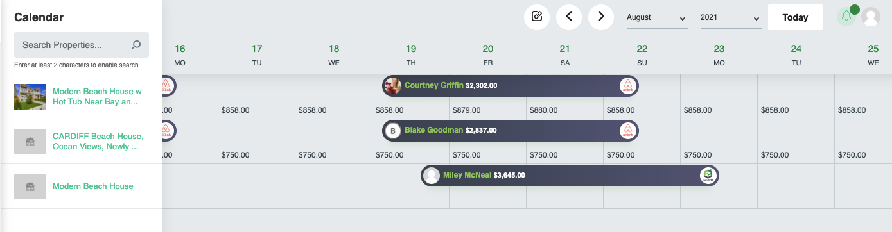
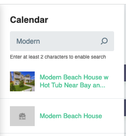
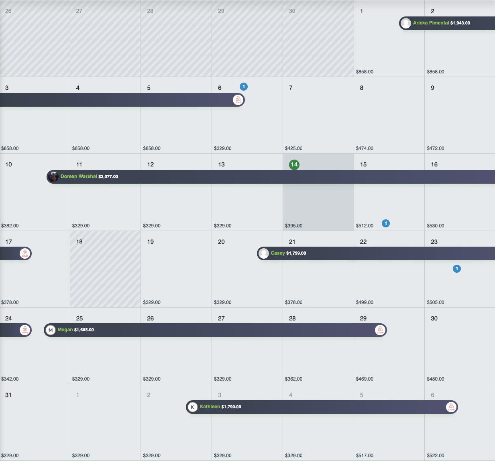
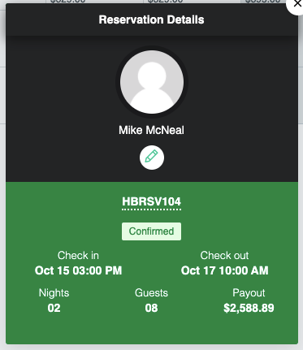
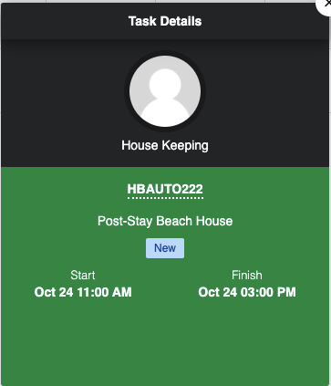
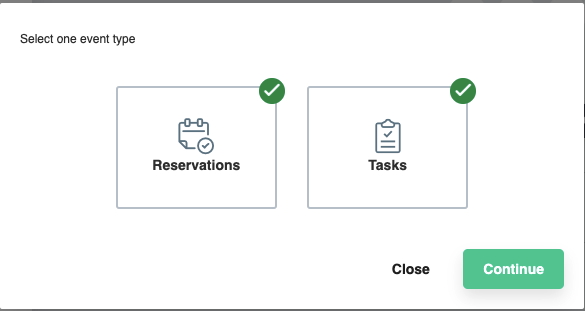
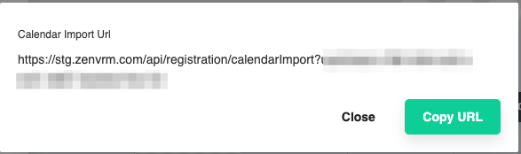

# Calendar
The calendar page provides a consoliated property view of availability, pricing, and reservation data.
!!! Tip "Quick Tips"
	- Shaded areas of the calendar indicate blocked dates
	- Clicking on a area with an existing reservation will bring up the [individual reservation metadata](#individual-reservation-metadata)
	- Clicking on the :material-link-box-variant-outline: button will provide an [exportable calendar](#exportable-calendar)
	- Areas of the calendar with a :fontawesome-solid-circle:{ .zenblue } indicate a task is present on the date. Clicking this will bring up the [task details](#task-details-metadata)
	- Clicking on an individual date box will bring up the [date configuration options](#date-configuration-options) where you can make adjustments
	- You can adjust the calendar dates view by clicking the :material-chevron-left: or :material-chevron-right: buttons or by clicking the :material-chevron-down: buttons to adjust the month or year

## Search
The search bar in the top left allows a text filter that will display properties matching the filter.

## Individual Property
Clicking on an individual property will provide an expanded monthly view of that property. All other buttons act the same on this page.

## Individual Reservation Metadata

## Task Details Metadata

## Exportable Calendar
Clicking the :material-link-box-variant-outline: button will allow you to share your calendar with other applications. 

### Event Type(s)
Choose to include reservations, tasks, or both and click "Continue"
!!! Note
	The calendar will be based on the current view. If you want to only export the calendar from a single property - you need to first click on that individual property to do so.

### Importable URL
After choosing the events you'd like to export, you can now copy the URL and import it into your third party calendar.
!!! Tip
	Providing a tasks url to your housekeeping staff is a great way to keep their calendar up to date.

