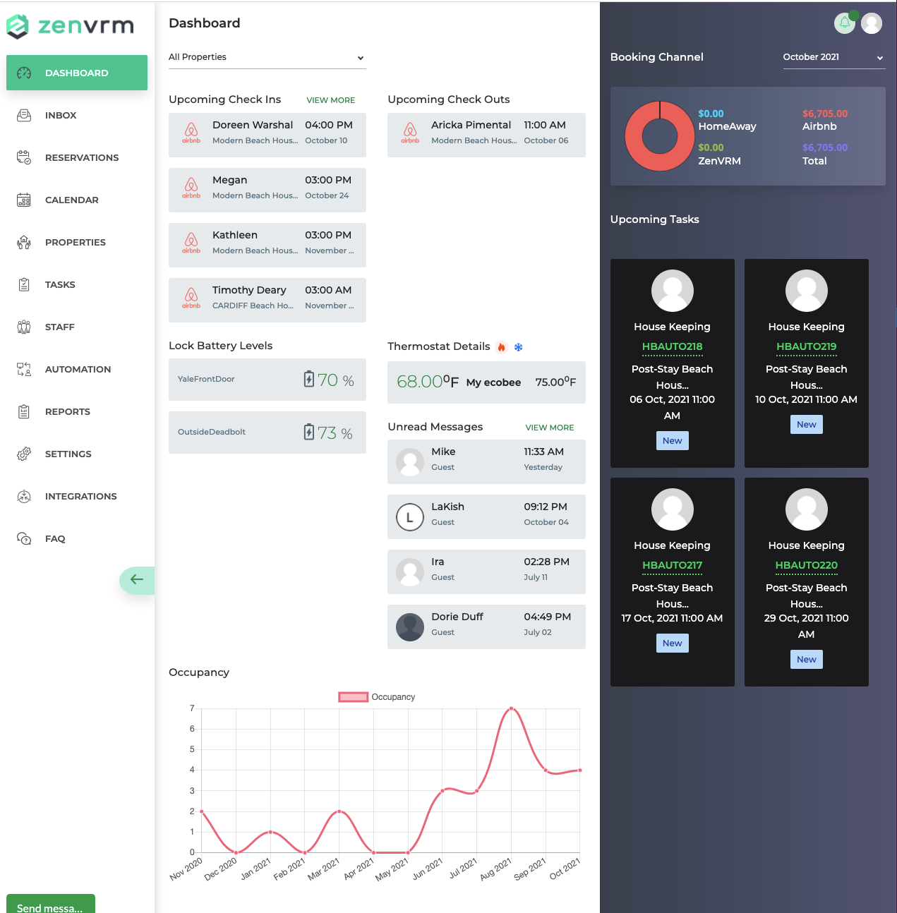
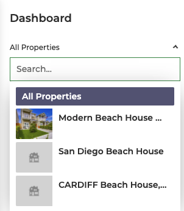
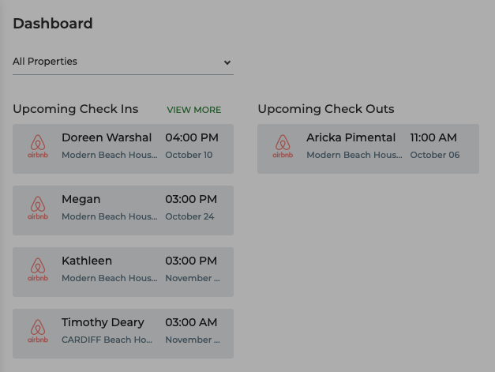
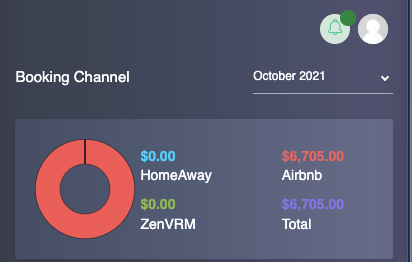
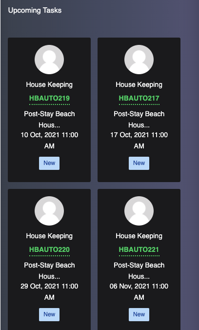
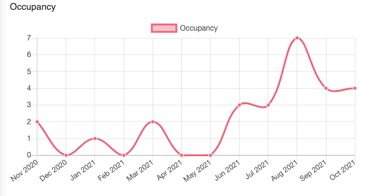

# Dashboard
The dashboard provides a high level consolidated overview of data within the application.

## Property Filter
By default, the data displayed is based on all properties within the system. By click the :material-chevron-down: button at the top, you can filter on any given property and the dashboard will update data specifically for that property. 

## Reservations
This provides information about the next 4 upcoming reservations as well as any existing reservations that are checking out. Clicking on any given reservation will take you directly to the booking data.

## Financial Summary

## Upcoming Tasks

## Smart Home
Provides basic details on all reservations. From here you can see your upcoming check-ins and details of past reservations. The ability to message guests directly from this section is available as well from the actions section.

## Occupancy

