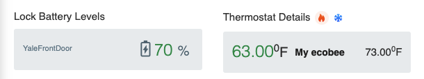

# Dashboard
The dashboard provides a high level consolidated overview of data within the application.

## Property Filter
By default, the data displayed is based on all properties within the system. By click the :material-chevron-down: button at the top, you can filter on any given property and the dashboard will update data specifically for that property. 

## Reservations
This provides information about the next 4 upcoming reservations as well as any existing reservations that are checking out. Clicking on any given reservation will take you directly to the booking data.

## Financial Summary
Provides total income on current month as well as a breakdown per-channel. The :material-chevron-down: button can be pressed to filter the month.

## Upcoming Tasks
Provides details of upcoming tasks assigned within the system. Clicking on the task identifier will take you directly to the task.

## Smart Home
This section provides basic details of integrated devices such as battery life or temperature details.

## Occupancy
Provides the amount of total reservations monthly over the past year.

