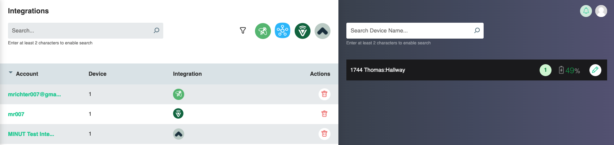

# Integrations
The integrations page allows you to add and configure third party devices and tools into the system for use with various engines.

## Adding a Smart Lock

## Adding a Thermostat
As an example, thermostat controls can be integrated 

## Adding a Noise Monitoring Device

## Supported Vendors
We will be frequently updating our supported vendors matrix as we continue to grow and build. Current support includes the following:

| Vendor      | Smart Controller                     | Devices            | 
| ----------- | ------------------------------------ |--------------------|
| Ecobee      | :octicons-x-16:                      | Thermostat         |
| Vera        | :octicons-check-16:                  | Smart Locks        |
| Samsung     | :octicons-check-16:                  | Smart Locks        |
| Minut       | :octicons-x-16:                      | Noise Monitoring   |

## Smart Controller Hardware Compatibility List
A broad variety of Zigbee and Z-Wave Smart lock integrations have been tested with Vera and Samsung smart home controllers. If the lock can be programmed with a pin, it should be supported. If you have a lock and would like to test supportability, please send us an email and we will work with you to test it and see if it can be integrated.

!!! Question "Tested Smart Lock Vendors"
	- Yale
	- Kwikset
	- Schlage
