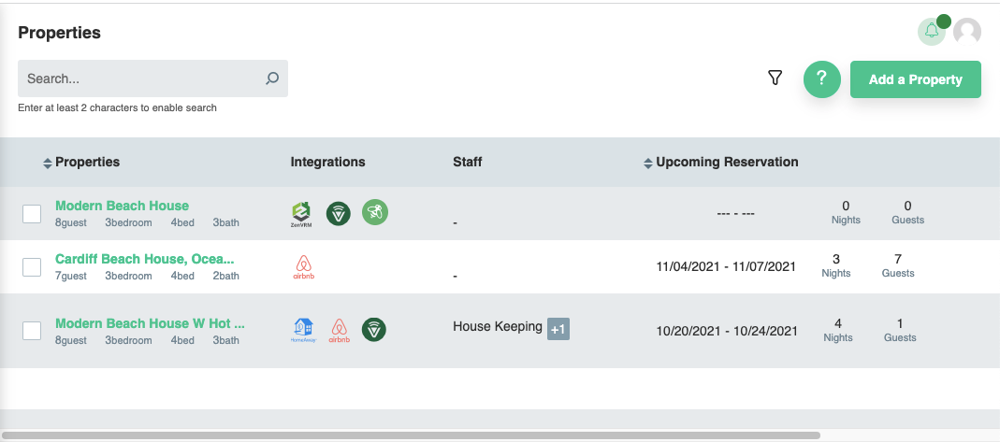
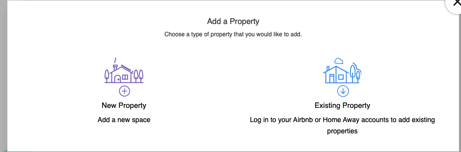
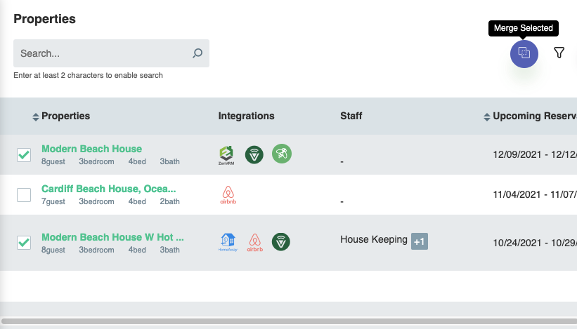

# Properties
The properties page provides a high level overview of the existing properties onboarded into the system

## Adding a property
The add a property screen allows you to add a new property (Zenvrm system property) or an existing property from a supported travel agency.

### New Property
The new property feature is for personal use to create personal reservations that you have established through your own channels on any given property. Automation will function on new property reservations as they would with existing properties. In the future, ZenVRM will support full direct bookings.

### Existing property
Please review the [initial setup](../getting-started/setup.md) page for adding an existing property reference.

## Merging Properties
If you have the same physical property added through multiple channels, it will show up as multiple properties in the system. By clicking the :material-ungroup: button, you will be able to combine the properties which consolidates them into one.

