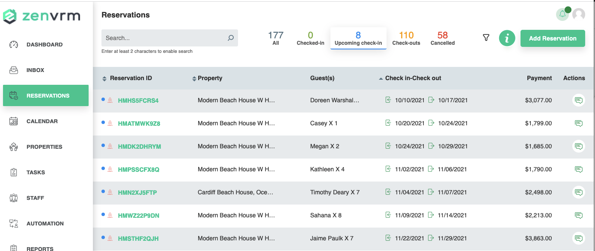
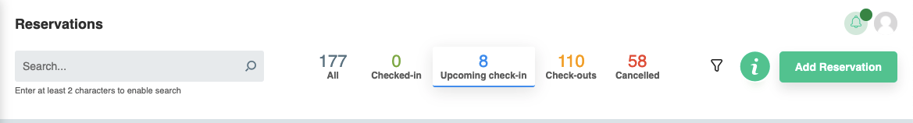
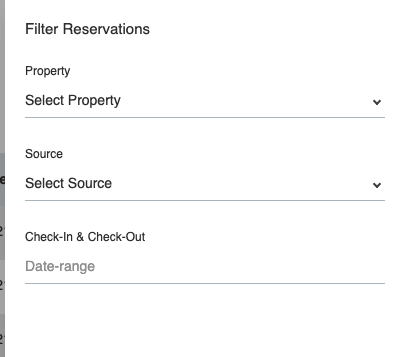
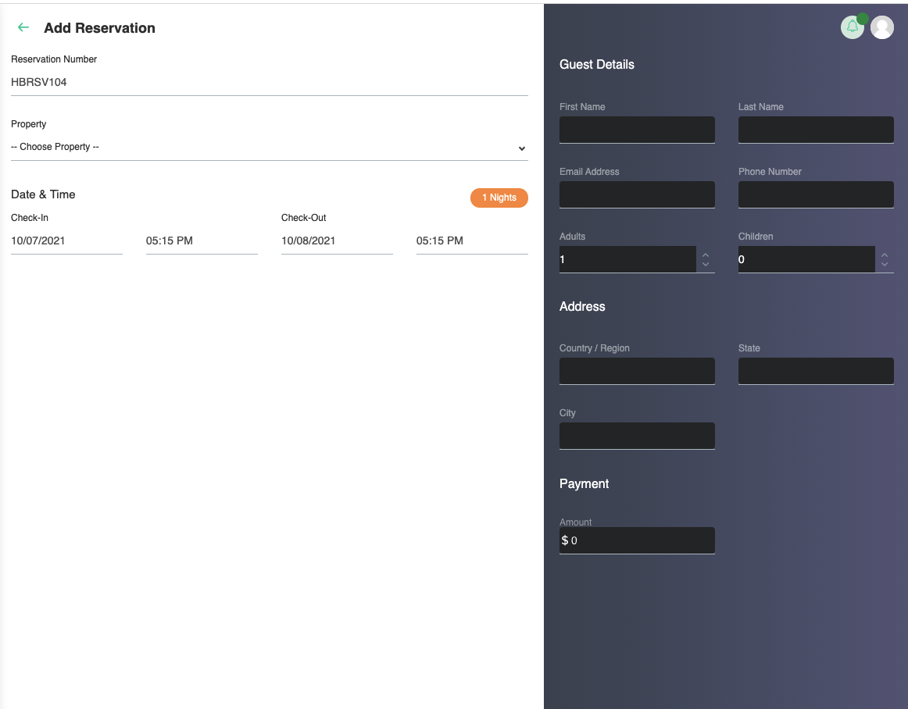
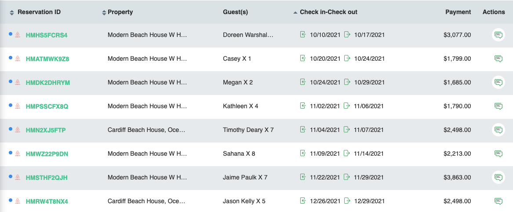
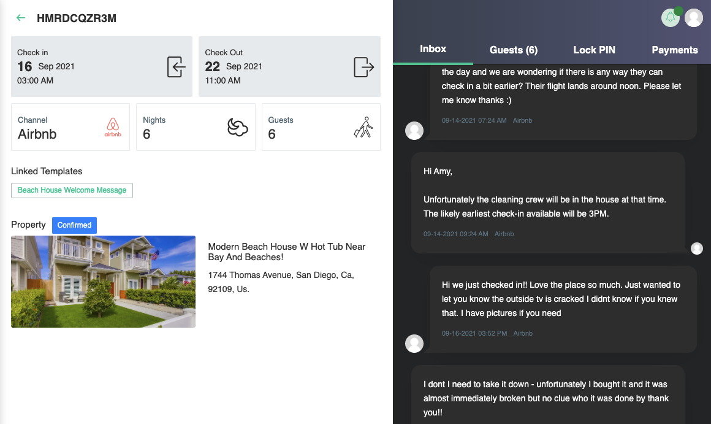
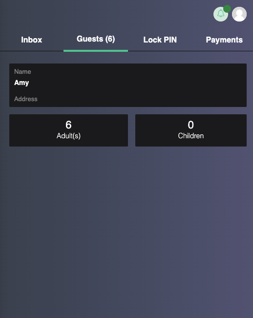
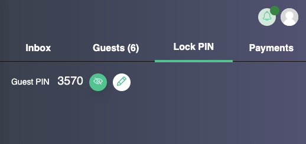
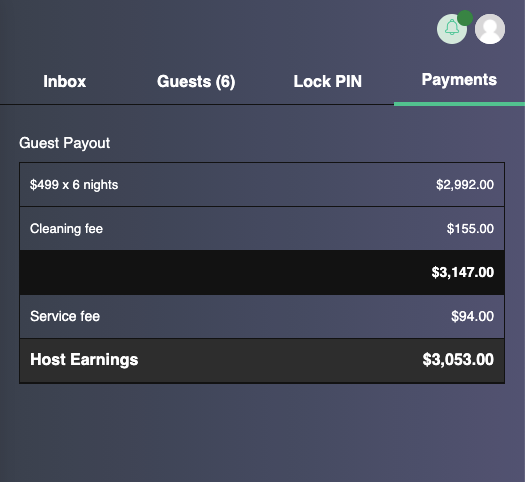

# Reservations
The reservations page provides a consolidated view of reservations in the system.

## Top Section
By default, the data displayed is based on all properties within the system. By click the :material-chevron-down: button at the top, you can filter on any given property and the dashboard will update data specifically for that property.

### Search Filter
Typing in the box with the :material-magnify: icon will filter on data in the reservation table similar to the inbox search filter. 

### Reservations by Status
The next area provides reservations by status
- All - all reservations
- Check-in - reservations with current guests
- Upcoming Check-In - future reservations
- Check-Outs - all past reservations
- Cancelled - reservations that have been cancelled

### Property Filter
Clicking the :material-funnel: icon will open the property filter. From here, you can filter the data by property, booking source, and date range.

### Add Reservation
Clicking the add reservation button will allow you to add a "zenvrm" reservation into the system. To enable communication, the guest email must be correct.

## Reservation Details
The lower area providing data based on the filters and buttons pressed from the top bar.

- Reservation ID - provides the identifier and channel for the reservation - clicking on this will provide full reservation data (below)
- Property - property to which the reservation applies
- Guests - name of primary guest and number of total people staying
- Check-in/Check-out - dates the reservation applies to
- Payment - total host payout
- Actions - clicking the :material-chat-processing-outline: button will bring a quick messaging window where you can communicate with the guest

## Individual Reservation Details
After clicking on the identifier from reservation details, information about an individual reservation is brought up. With the "Inbox" tab opened by default. Again, quick messages can be sent from this tab utilizing the :material-send: icon after providing input in the response field.

### Guest information
Clicking the guest information tab will provide details of the guest that is scheduled for the reservation.

### Lock Pin
The lock pin section provides details on the pin code that is applied on any integrated smart locks for the property. Clicking the :material-pencil: icon provides the ability to change this code.

### Payment
The payment section provides financial details of the reservation.

