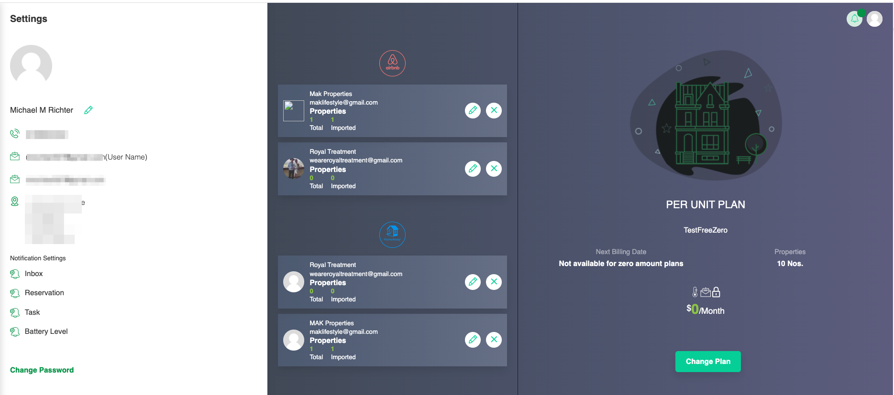

# Settings

The settings page allows you to configure basic account details, change your password, and configure notifications you'd like to receive. Once we move on from Beta testing, your subscription options will be available as well.

