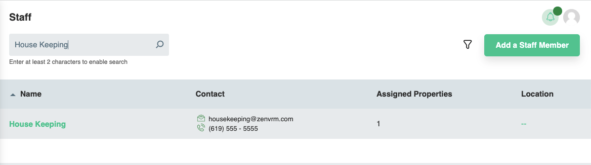
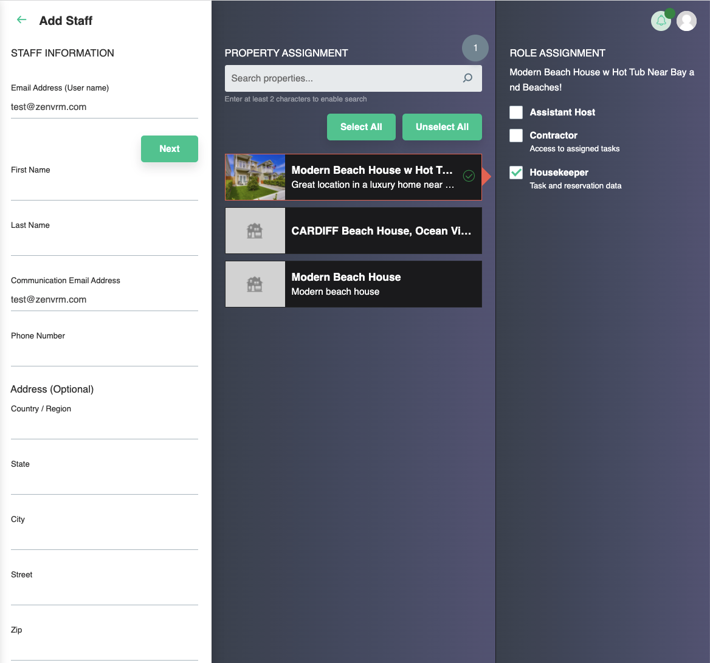

# Staff
The staff page provides the ability to manage a team that can be given specific roles and assigned to one or more properties. The search :material-magnify: section functions the same as others and the filter :material-filter-outline: allows filtering of staff based on role and property.

## Adding a Staff Member
Click the "Add a Staff Member" button allows the onboarding of a new staff member. After inputting the user email address click the "Next" button and provide details of user. Select one or more properies and the role for the staff member and click "Save"

!!! Note
	The new user will get a confirmation email to activate their account.

### Roles
 * Assistant Host - Has all the privileges and information provided to the primary account owner on selected properites.
 * Housekeeper - Access to reservations and assigned tasks. No access to inbox or financial data associated with reservations.
 * Contractor - Only access to assigned tasks.

## Managing Existing Members
You can edit roles and properties or delete existing members from the "Actions" section by clicking the :material-pencil-outline: or :material-trash-can-outline: icons respectively.
