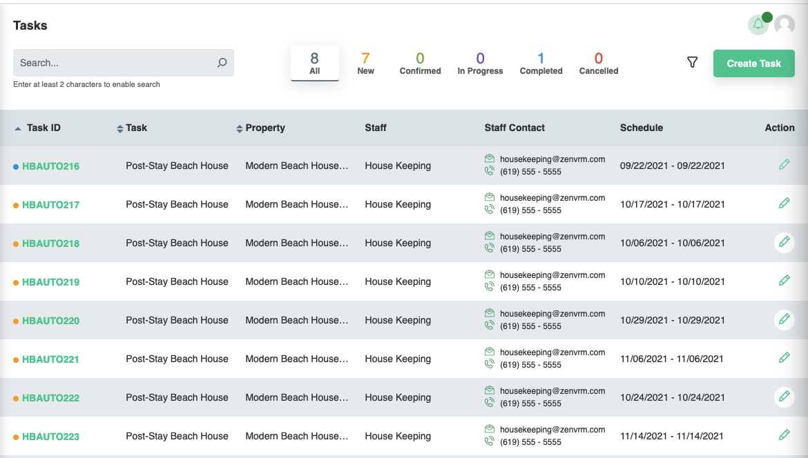
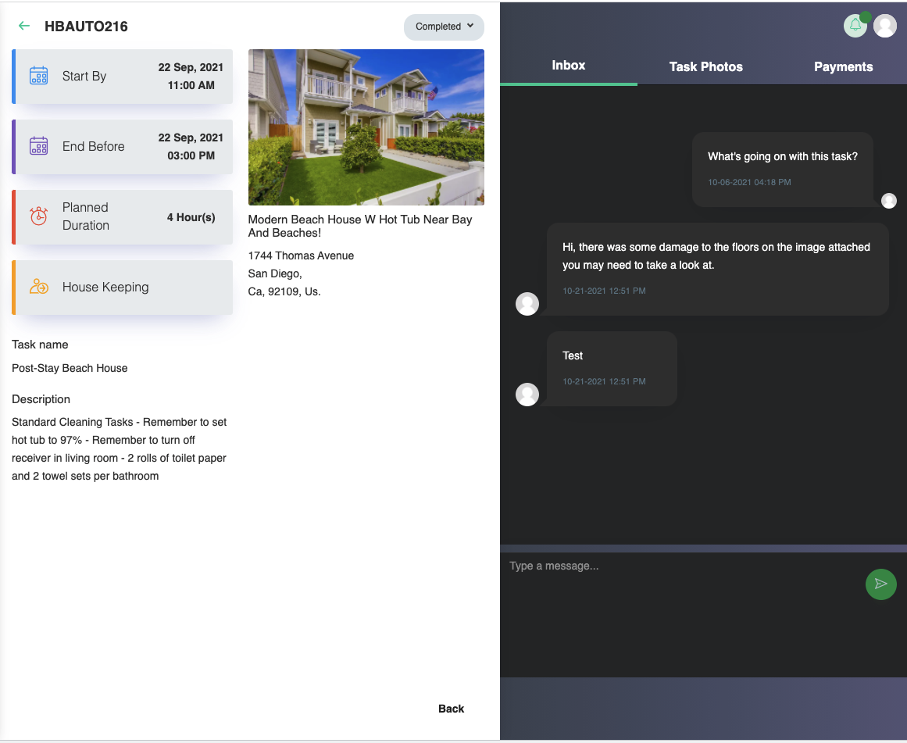
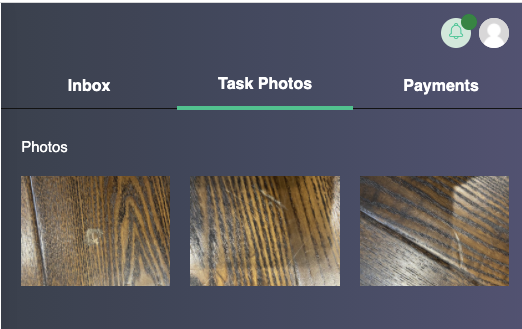
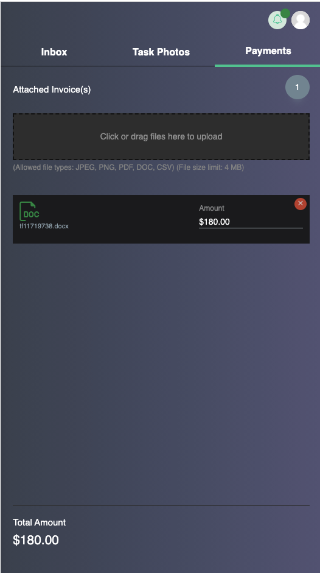
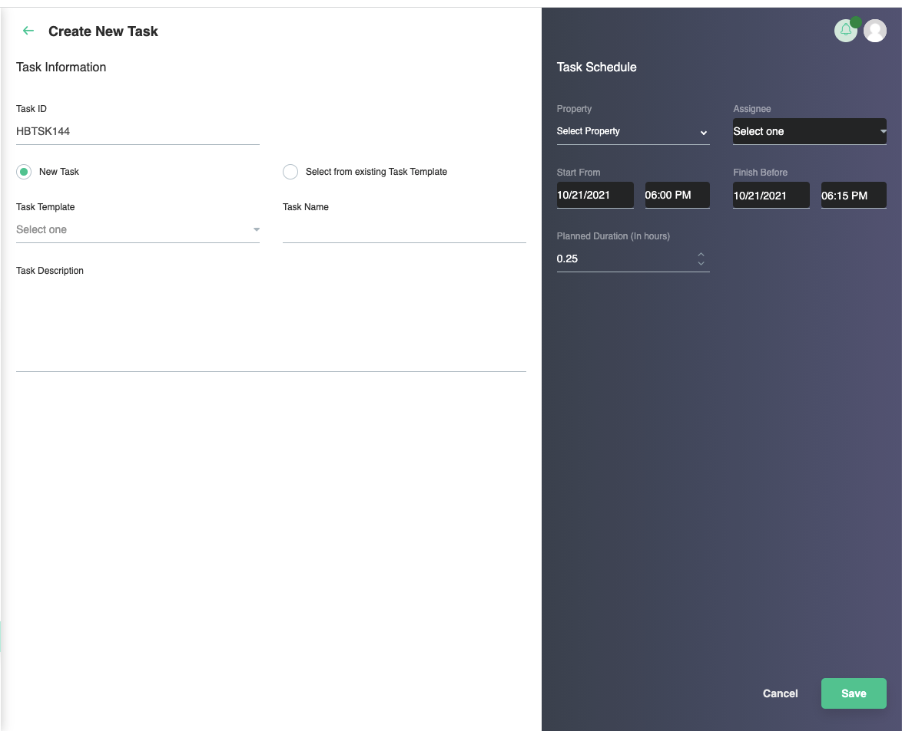
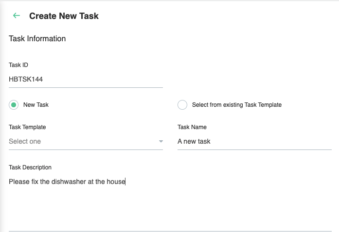
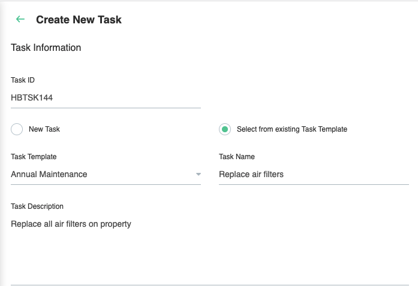
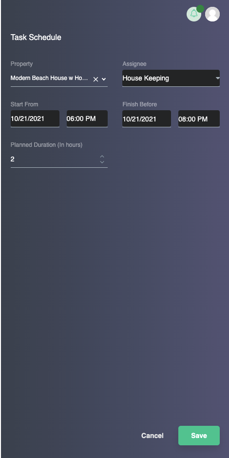

# Tasks
The tasks page provides a consolidated view of all tasks in the system. The layout here is nearly identical to the [reservations](../reservations.md) page, so in the essence of saving time, you may use that page as a reference should you need it. From this page, you can view existing tasks as well as create and assign new tasks to your staff members.

## Existing Tasks
Clicking on any existing task from the *Task ID* column will bring you directly to the full task details page. The middle section provides full details of the task and the section on the right includes the converation history with the staff member assigned, any uploaded photos, and financial data if the person assigned added an invoice.

### Photos
Photos are useful in the event a previous guest may have caused damage to the property. It also provides a mechanism to provide feedback to the host on other potential issues at a property.

 

### Payments
The payments tab provides the ability for a staff member to attach an invoice and provide a payment amount. This can later be used in financial reporting.

## New Tasks
New tasks can be created and manually assigned to a staff member.

### Ad-Hoc task
With an ad-hoc task, the task name and description are set manually. 

### Task from Template
By seletcting drop-down for task template, the name and description are pre-populated based on templates you've already created. This is useful for tasks that occur on a semi-frequent basis, but not enough for full automation.

### Task Configuration
The task configuration allows you to assign the schedule, property, and staff member to a new task.

!!! Note
	Saving a new task will automatically email and send a calendar invite to the staff member notifying them that the task has been created and assigned.

