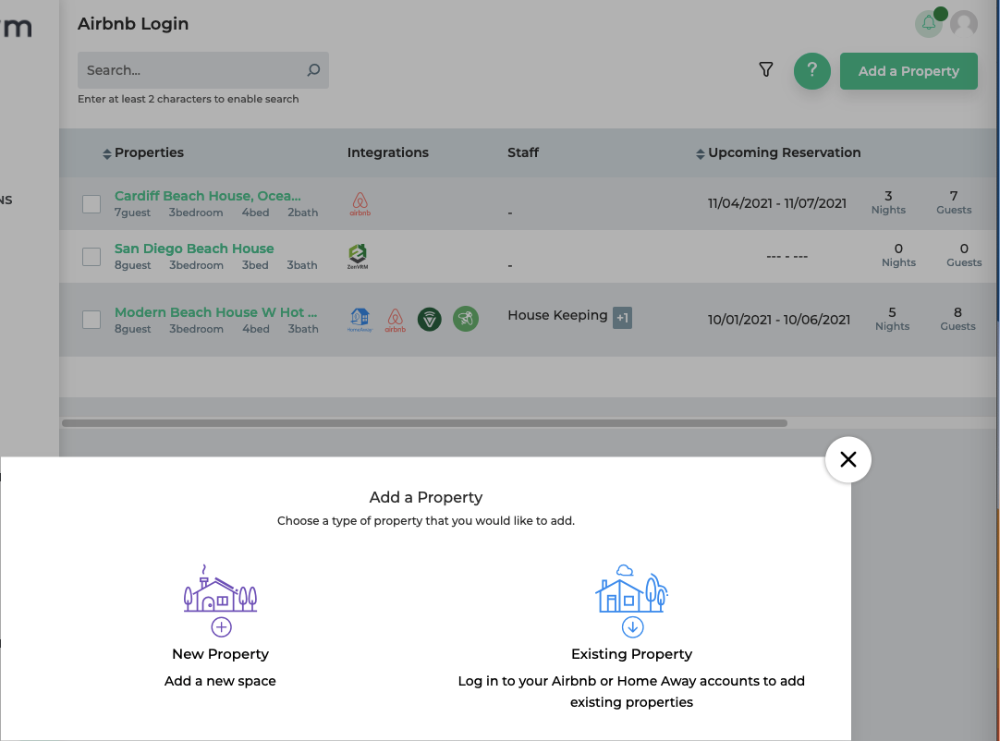
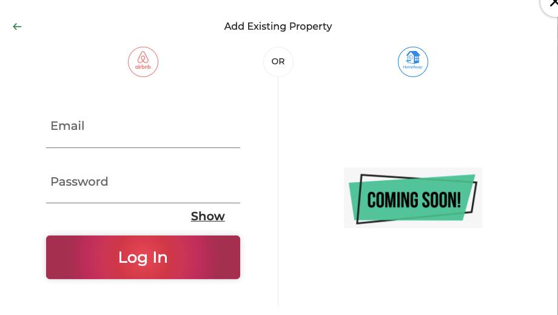

# Getting Started
This document provides details to get up and running quickly.

## Sign up for an account
Sign up for an account at the [zenvrm account signup](https://stg.zenvrm.com/index.html#/session/signup) page.

## Onboarding a property
After signing up for an account and logging in - on the side menu navigate to *Properties*, click the "Add a Property" button, and click "Existing Property."

### Airbnb Onboarding Example
After signing up for an account and logging in - on the side menu navigate to Properties, click the "Add a Property" button, and click "Existing Property."

Provide the email and password for the Airbnb account you'd like to add.

!!! Note
	:clipboard: Zenvrm does not store account credentials - your password is only used to authenticate to the platform. If your authentication token expires, you will be notified that your Airbnb account has been disconnected and be requested to add your password again.

Once you've provided your credentials select one or more properties to add to your account and click "Proceed."

!!! Note
	:clipboard: After adding a property, it typically takes 30 minutes to fully integrate details into the platform.

